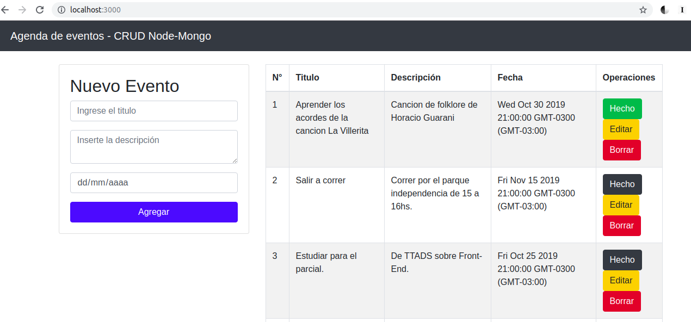

<h1 align="center">
  
</h1>
<h5 align="center">Universidad Tecnologica Nacional</h5>

##### Materia: Técnicas y Tecnologías Avanzadas de Desarrollo de Software 2019

# Trabajo practico de Backend

## REST API

 * Para iniciar la plicación, se debe ejecutar con NodeJS el archivo **src/server.js**

Peticion | Ruta | Descripción
--|--|--
 GET  | /api/tareas | Pagina principal.
 POST  | /api/tareas | Nueva tarea.
 GET   | /api/tareas/:id | Encontrar tarea con su id.
 PUT   | /api/tareas/:id | Modificar una tarea existente.
 DELETE | /api/tareas/:id | Eliminar una tarea.
 GET | /api/tareas/:id/completada | Cambiar tarea a estado "COMPLETADA".

## Alcance

### Funcionalidad

 * La aplicación se trata de una agenda de tareas. Cada tarea tiene los atributos:
 	* **titulo**, tipo String.
  	* **descripcion**, tipo String.
   	* **fecha**, tipo Date.
   	* **estado**, tipo Boolean.
 * Desde la pagina principal, el usuario puede agregar una nueva tarea, modificar una existente o eliminarla.
 * En caso de haber completado una tarea, el usuario tiene la opcion de cambiarla al estado "COMPLETADA".
 * Cada vez que el usuario ingresa a la pagina principal, en ella se mostrar la lista de tareas existentes, con sus respectivos atributos y opciones para editar, eliminar o establecerla como completada.

### Desarrollo

 * La API esta desarrollada con un backend utilizando API REST y un frontend con la libreria **ejs** de node.
 * El backend esta programado en **JavaScript** con **NodeJS**.
 * Utiliza el framework/middleware **express** para la configuración basica de la aplicación.
 * La persistencia se realiza utilizando el ODM **Mongoose** con una base de datos **MongoDB**.

### Captura de la aplicación

<h1 align="center">
  
</h1>
<h5 align="center">Aplicación corriendo</h5>

## Entorno 🛠️

* **Node.js v10.16.3**
    * Express
    * Hotnode
    * Mongoose
    * Body Parser
    * Method-override
    * Ejs
    * Morgan
    * Cors
* **Node Package Manager NPM v6.9.0**
* **MongoDB v4**
    * Mongoose
* **Angular v8.2.2**
* **Bootstrap v4**


## Node 🚀

* [Pagina Oficial ️️️️️⚡️](https://nodejs.org/es/) - Framework Node

## [Instalar con CURL ⚡️](https://github.com/nodesource/distributions#debinstall) 🔧

```
curl -sL https://deb.nodesource.com/setup_10.x | sudo -E bash -
sudo apt-get install -y nodejs
```
## Node Package Manager 🚀

[Comandos basicos NPM ⚡️](https://vortexbird.com/comandos-basicos-de-npm/)

Npm is distributed with Node.js- which means that when you download Node.js, you automatically get npm installed on your computer.
### Chequear versiones
```
node -v
npm -v
```

### Nota
Npm is a **separate project from Node.js**, and tends to update more frequently. As a result, even if you’ve just downloaded Node.js (and therefore npm), **you’ll probably need to update your npm**. Luckily, npm knows how to update itself! Run:

```
npm install npm@latest -g
```

### Instalar desde terminal:
```
sudo apt-get install npm
```

### Errores resueltos

1. Setear repositorio y desactivar SSL
```
npm config set registry http://registry.npmjs.org/
npm config set strict-ssl  false
```

2. Limpiar cache
```
npm cache clean (Si tira error agregar --force)
```
## Angular 🚀

[Pagina Oficial ⚡️](https://angular.io/start) - Framework front-end
### Agregar Angular como dependencia al proyecto 🔧

```
npm install -g @angular/cli
```

### Crear proyecto y desplegarlo
```
ng new my-app
cd my-app
ng serve –open
```

_The - -open (or just -o) option automatically opens your browser to http:/localhost:4200._


#### Agregar un nuevo componente "heroes" en angular 🔧
```
ng generate component heroes
```

## MongoDB 🚀

* [Pagina Oficial ⚡️](https://www.mongodb.com/es) - Base de Datos mongodb

### Mongo Daemon 🔧
```
mongod --dbpath /data/db --logpath /data/log/mongod.log --fork --replSet "M103" --keyFile /data/keyfile --bind_ip "127.0.0.1,192.168.0.100" --sslMode requireSSL --sslCAFile "/etc/ssl/SSLCA.pem" --sslPEMKeyFile "/etc/ssl/ssl.pem"
```

### Mongo Database 🔧

```
mongo --username m001-student --password m001-mongodb-basics
```

_At cluster mongodb://cluster0-shard-00-..._
```
mongo "mongodb://cluster0-shard-00-00-jxeqq.mongodb.net:27017,cluster0-shard-00-01-jxeqq.mongodb.net:27017,cluster0-shard-00-02-jxeqq.mongodb.net:27017/test?replicaSet=Cluster0-shard-0" --authenticationDatabase admin --ssl --username m001-student --password m001-mongodb-basics
```

_Object JSON example in MongoDB_

```
{
   "_id": ObjectId(7df78ad8902c),
   "title": "MongoDB Overview",
   "description": "MongoDB is no sql database",
   "by": "tutorials point",
   "url": "http://www.tutorialspoint.com",
   "tags": ["mongodb", "database", "NoSQL"],
   "likes": "100"
}
```
## Autor

* **Nicolas Mateucci** - *Trabajo Practico TTADS Backend* - [Github oficial ⚡️](https://github.com/nicomateucci)

--------------------------------------------------------

### Plantillas README

[Ejemplos **muy buenos** de uso de Markdown Langauge](https://github.com/ricval/Documentacion/blob/master/Guias/GitHub/mastering-markdown.md#ejemplos)

[Modelo de plantilla para hacer un buen README ⚡️](https://gist.github.com/Villanuevand/6386899f70346d4580c723232524d35a)


🚀 📋 📦 🛠️ 📄 🎁 📢 🍺 🤓 🔧
